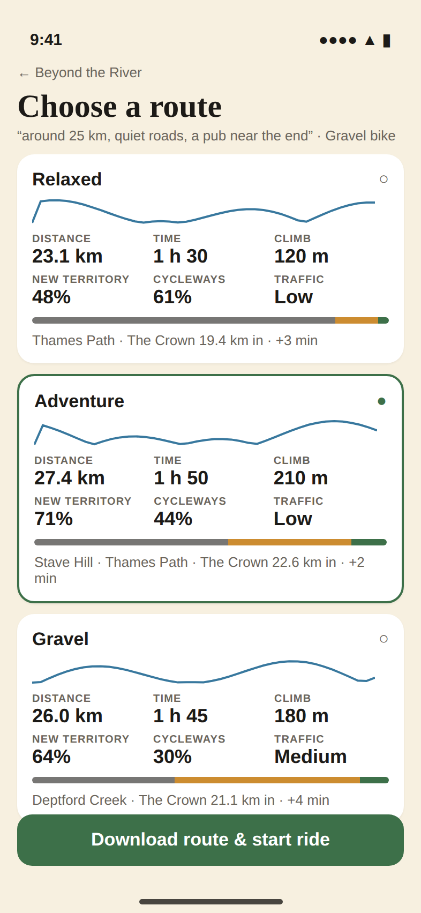
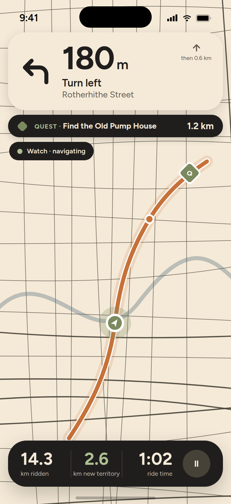

# Routing

| Route alternatives | Navigation |
|---|---|
|  |  |

## Pipeline

```
RouteGenerateRequest
  ├─ rider profile + bike → base RoutePreferences
  ├─ free text → parse_request (rules, or Claude when LLM_PROVIDER=anthropic) → preferences
  ├─ quest → target points, RETURN_TO_START, heading
  └─ for each label (3 from scoring.json bikeDefaultLabels, adjusted by preferences):
        overlay label preferences → custom model → GraphHopper request
        → analysis (elevation, climbs, surface, cycleway, traffic)
        → new-territory fraction (H3 vs user's cells)
        → quest objective coverage
        → POI corridor search
        → score → Route row
sorted by score; best becomes quest.suggested_route_id
```

Labels are never "Route 1/2/3": Relaxed, Adventure, Scenic, Direct, Gravel,
Challenge, chosen per bike type and adjusted when the request asks for
gravel, hills or a destination.

## Reading a request

A rider types one sentence. Claude reads it — there is no keyword parser behind
it any more. There used to be: word lists for every way of saying "pub", a regex
per preposition, a table of number words, and a rule that whatever was left of
the sentence might be a place. It answered the phrasings someone had thought of
and nothing else, and "quiet roads" planned a ride in Roads Wood.

`app/routing/preferences.py` holds the prompt and a JSON Schema the API
enforces (`output_config.format`, falling back to describing the schema in the
prompt where that parameter is not taken). Every field comes back null when the
sentence did not say it, so the rider's own profile stands.

The sentence can name a place in one of three ways, and they plan different rides:

| They wrote | Reads as | The ride |
|---|---|---|
| "a loop **in** Notting Hill with 5 pubs" | `area` | Moves there, wanders around it, comes home |
| "go **to** the Aragon Tower, 2 pubs on the way" | `destination` | Starts where they are, finishes at the tower |
| "visit **the Moby Dick** then to Aragon Tower" | `via` | Passes through that pub on the way to the tower |

`via` and `stops` look alike in a sentence and are not the same promise. **A name
is the whole test**: "2 pubs on the way" names no pub, so the router picks
whichever two suit the line (`stops`); "the Moby Dick" is one pub and no other
will do, so it is a waypoint (`via`). Read the wrong way round, a rider asking
for their local gets a ride past a stranger's — which is what it used to do,
because the name was dropped and only "1 pub" survived.

**The model returns names, never coordinates.** `app/routing/geocode.py` resolves
them, so nothing it invents reaches navigation (spec §20, §31). The two resolve
differently, because a wrong answer costs differently:

* `area` searches Photon and Nominatim for ground — `place`, `boundary`,
  `leisure`, `natural`, `landuse`, `tourism`. The whole ride moves there, so a
  shop matching the phrase would waste the ride.
* `destination` and each `via` (`kind="point"`) accept nearly anything named: a
  building, a tower, a bridge, a pub, a station. The guard is the name instead —
  the answer has to be called what the rider called it, or a point search will
  happily return a bakery for "the way home".

A destination that resolves becomes a real waypoint: `loop` defaults off, the
stops are picked from the corridor along the way (`_pick_stops_between`, in the
order they are reached) rather than rung around the origin, and the target
distance comes from the trip rather than the app's slider. One that does not
resolve is said out loud in `parsedRequest.notes` — riding somewhere else
quietly is the worse answer.

Each `via` that resolves goes on the line in the order the rider said it, before
the finish, and the trip's own length is measured **through** them: a pub two
kilometres off the direct line makes the ride longer, and scoring it against the
straight distance marks the only route that does what was asked for as too long.
One that does not resolve is named in the notes as well, and the rest of the ride
is planned without it.

Everything the model returns is range-checked in `parse_request`: a category
nobody imports, a 900 km "ride", a null where a float was expected. A bad answer
narrows to a plain ride, never a wrong one.

### No provider, no reader

`LLM_PROVIDER=anthropic` is the default, but with no `ANTHROPIC_API_KEY` there is
nothing to read a typed request. The planner says so
(`parsedRequest.notes`) and plans from the rider's profile. It does not guess.

### Testing it

Two different questions, tested in two places:

* What the planner *does* with a reading — `tests/test_route_requests.py` and
  `tests/test_llm_parse.py`, against a scripted model (`SCRIPT` in
  `tests/conftest.py`). No network, no spend.
* Whether the model reads a sentence *correctly* — `tests/test_request_reading.py`,
  against the real API, skipped unless `ANTHROPIC_API_KEY` is set:

  ```bash
  ANTHROPIC_API_KEY=sk-... pytest tests/test_request_reading.py
  ```

  A failure there means the prompt needs the case, not that a word list needs
  another word.

## Engine

`GraphHopperClient` posts to `/route` with `ch.disable=true`, a custom model,
elevation and details. Loops use `round_trip` with a user/origin-derived seed
per label; with a quest destination the loop is headed towards it and the
target is inserted as a via-point. Point-to-point uses `alternative_route`.

`SyntheticRouter` produces plausible loops for tests and for development when
GraphHopper is down. Routes carry `engine`; production refuses to boot on the
synthetic engine and clients should treat `engine == "synthetic"` as
non-navigable.

## Custom models

Base profiles (`routing/custom_models/*.json`) encode bike capability and
block motorway/trunk. `app/routing/custom_models.py` turns preferences into a
request-time overlay: traffic aversion penalises primary/secondary/tertiary,
cycleway preference lowers everything that is not cycling infrastructure,
gravel preference and bike capability adjust unpaved surfaces and tracks, low
hill tolerance penalises `average_slope >= 6`, scenic preference favours
non-road environments. Overlays multiply priorities and can only reduce them
for unsafe classes.

## Analysis

* Elevation samples every 100 m from the returned 3D coordinates; smoothing
  window 3; ascent/descent with 3 m hysteresis; max gradient over samples;
  climbs = rising stretches ≥ 30 m gain and ≥ 2 %, ended by a 15 m drop;
  longest climb and average climb gradient.
* Surface composition from `details.surface` buckets (paved, gravel, trail,
  unknown), cycleway fraction from `road_class == cycleway` or bike network,
  traffic exposure = length-weighted road-class score.

## Scoring

```
score = ( w1·preferenceFit + w2·questFit + w3·exploration + w4·poi + w5·scenic
        − w6·traffic − w7·difficulty − w8·surfaceMismatch ) / Σ positive weights
```

Weights in `backend/app/routing/config/scoring.json`. Difficulty penalty
compares distance, climbing and max gradient against the rider profile (never
the RPG level). Surface mismatch penalises gravel/trail on bikes that do not
allow them.

## POIs

Candidates come from `discoveries` within 60 % of the target distance
(PostGIS `ST_DWithin`); `attach_pois` keeps those within a 400 m corridor and
computes route position, detour distance/time, ETA and relevance (boosted for
the requested category near the requested position). Output: "The Crown ·
24.6 km into ride · +600 m · +3 min".

## Route package

`GET /routes/{id}/package` bundles route geometry, instructions, elevation,
climbs, POIs, the quest and a map region for offline use. The client stores
it before starting and navigates from it without network.

## Rerouting

The client detects off-route (> 40 m cross-track for 3 fixes), tries to rejoin
and, after 30 s (throttled to once a minute), requests a new route from the
current position with the same quest; quest objectives, not the original
polyline, decide completion.
