# Screens

The images below are renders of the app screens as designed in the Claude
Design project *Cycling Companion* (`docs/design/`), drawn with the same
tokens, fonts and layout the SwiftUI code uses. They are HTML/CSS renders
with synthetic ink maps, not device captures; regenerate them with
`node docs/screenshots/render.js` (see the header of that file). Replace
them with simulator screenshots once the app has been run.

Each screen names the design option it implements (turn 2 of the design
file: `9a`, `10a`, …), so the design canvas and the code can be compared.

## Design system in one paragraph

Cream ground, surface cards and pills. Terracotta is reserved for *the*
route and the one primary action on a screen; sage is the calm second
voice ("you are here", success, the Explorer). Class colour touches
emblems, quest markers and XP bars only. Caprasimo is the companion voice
(screen titles, quest and route names, primary buttons); Figtree carries
body copy and every number a rider reads while moving. Shape carries
meaning before colour: quest waypoints are diamonds, riders are circles,
friends are initials, mysteries are dashed `?` circles. Speed appears
nowhere on a primary surface.

## iPhone

| Choose your class (11a) | World (9a) | Quests |
|---|---|---|
| 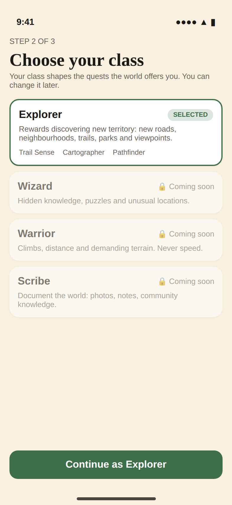 | 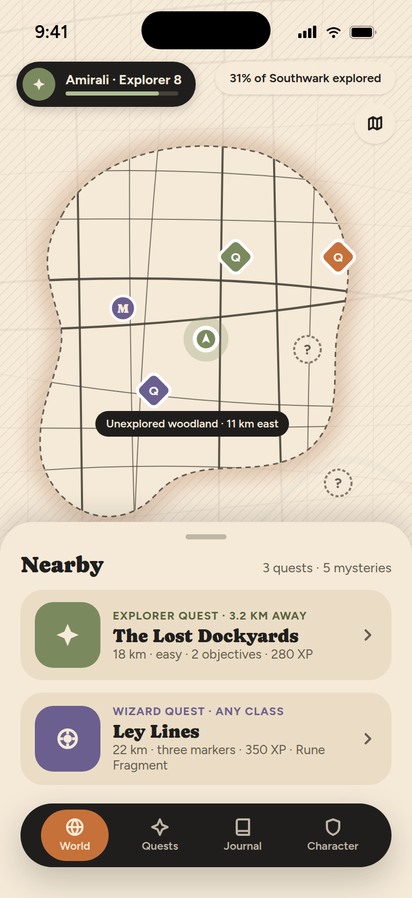 | 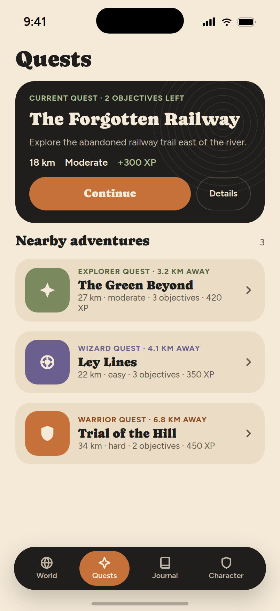 |
| Four heraldic cards, each with its fantasy in one line and how it plays. Any class can take any quest; the others are visible but locked behind feature flags. | The home is a map used like any maps app: a search pill (the rider's emblem and level at its end), place shortcuts (Cafés, Pubs, Parks…), tap a labelled place or long-press to drop a pin, then "Ride here". Fog of war and discoveries stay on the map; quests live on the Quests tab. | The current quest as the big ink card, then nearby adventures as rows with class tiles. |

| Quest detail (10a) | Three ways to ride it (2a) | Navigation (12a) |
|---|---|---|
| 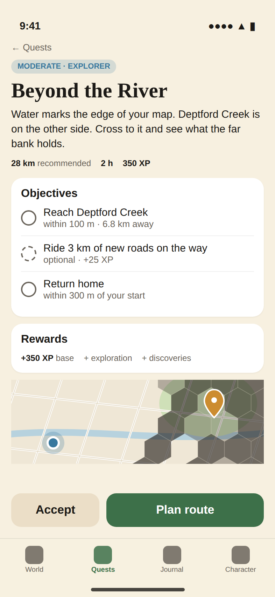 |  |  |
| Map-led: the quest's fixed route drawn through numbered diamonds, the story in one paragraph, objectives as a checklist, journey facts (from the route) and the suitability line before Begin. Begin opens the planner on that route; "Tweak the route" reveals the request, distance and bike controls. | Stacked cards on one map; each leads with why this route; a surface strip and climbing make differences readable without the map. Never "Route 1/2/3". | Instruction card on cream, the quest as a quieter ink line with distance to the objective replacing speed in the stats pill. |

| Objective complete (12b) | Adventure complete (13b) | Journal (14a) |
|---|---|---|
| 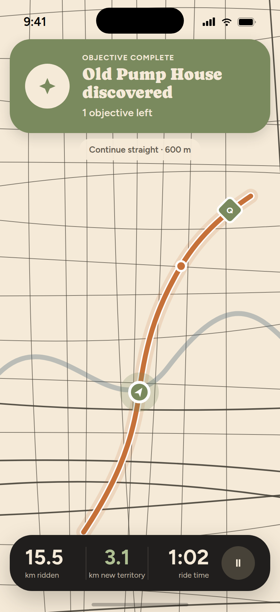 | 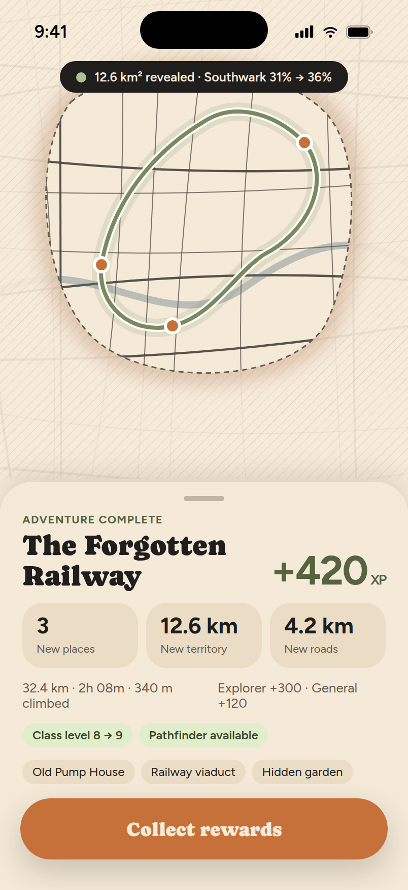 | 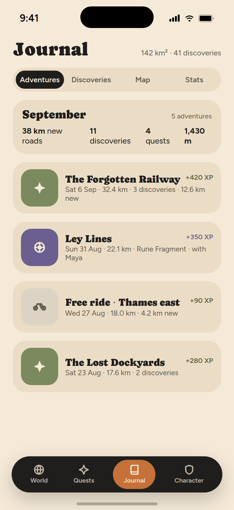 |
| A sage card replaces the instruction for a few seconds with the rising-triplet haptic, then navigation returns. No tap required. | The ride's newly opened territory glows on the ink world first; rewards slide up beneath, cycling stats stay one quiet line (§40). | The month in exploration terms, then completed quests as entries. Statistics is a tab, not the headline (§41–42). |

| Character (11b) | Friends (15b) |
|---|---|
| 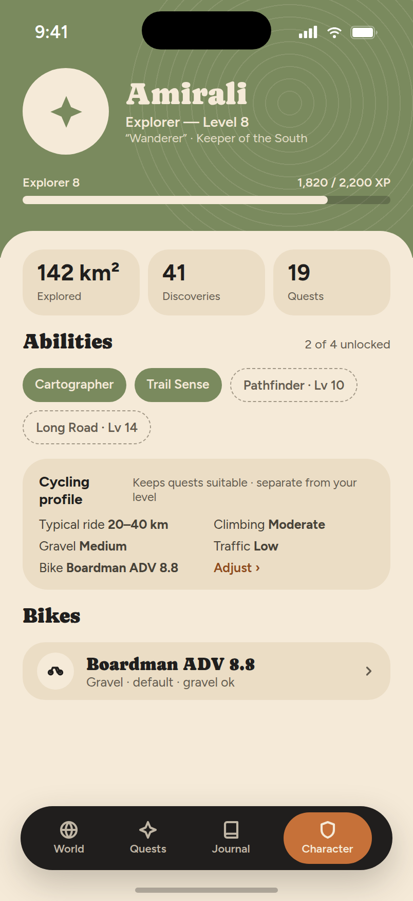 | 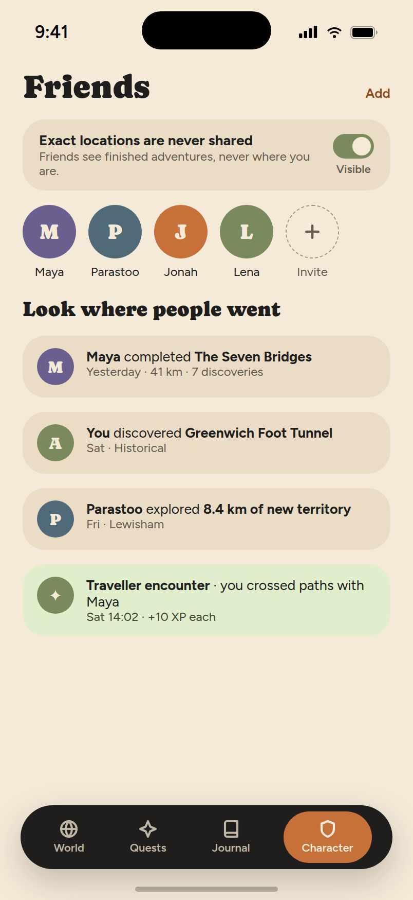 |
| Heraldic mark, class level and XP, abilities as pills, and beneath it a clearly separate Cycling Profile that keeps rides suitable. | The light feed: "look where people went". Exact locations are never shared. |

## Apple Watch (7a, 16a)

| Navigation (§44) | Quest (§45) | Ride (§46) | Objective complete (§47) | Always-On (§48) |
|---|---|---|---|---|
| 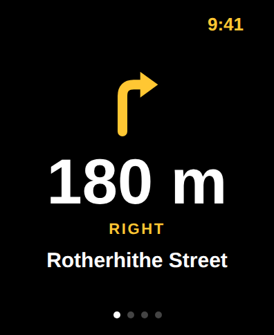 | 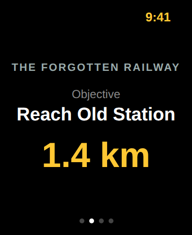 | 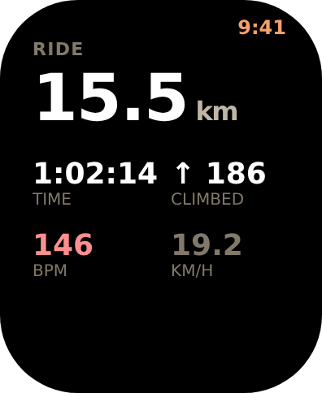 | 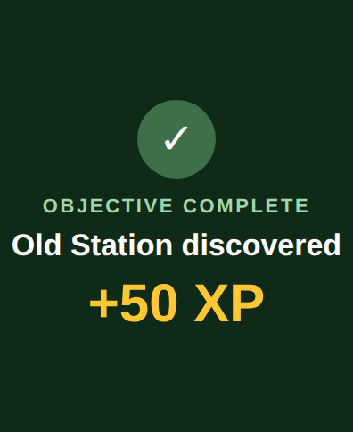 | 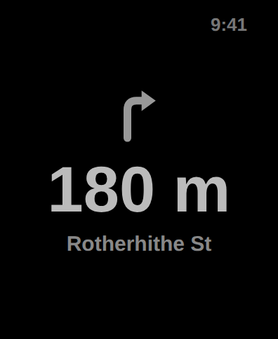 |
| Terracotta arrow, huge distance, direction word, street. | Sage diamond, the objective, the distance to it. | Distance first; time, climb, new territory in sage; speed demoted. | Full sage takeover, rising triplet, returns to the arrow. | No seconds, thinner weights, 1 Hz. |

## Product states carried into the code (8a–8g)

- GPS weak: an ink status pill under the instruction card; directions continue.
- Watch disconnected / reconnecting / off: the sage "Watch · navigating" pill changes its dot.
- Off route (4c): the instruction card changes voice, not colour alone; one haptic, no dialog.
- Paused (8d): the stats pill becomes the paused card; Resume is the big sage pill, End sits beside it.
- Route cannot be generated (8f): the planner shows the server's message and keeps the request editable.
- Your own adventure (1a without a quest): the dashed "Ride somewhere new" card on the Quests tab, or the terracotta button on the World, opens the planner with no quest; "Ride here" on a place opens it with that destination (A → B, no distance slider). The ride is named from the request or "Ride to <place>", and the Journal and summary show that name instead of "Free ride".
