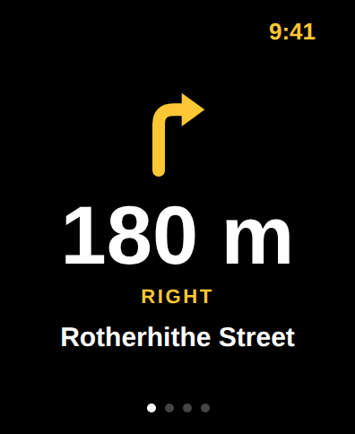
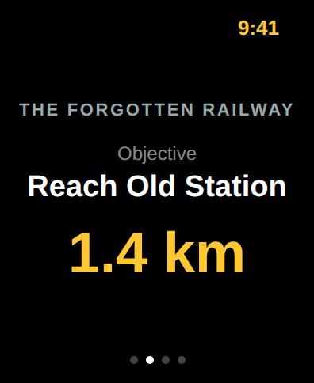
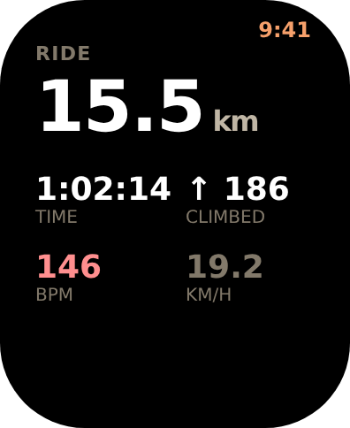
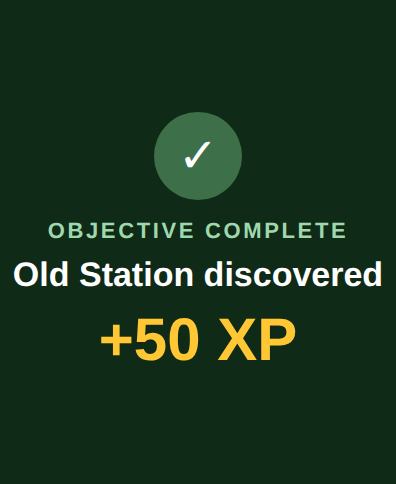
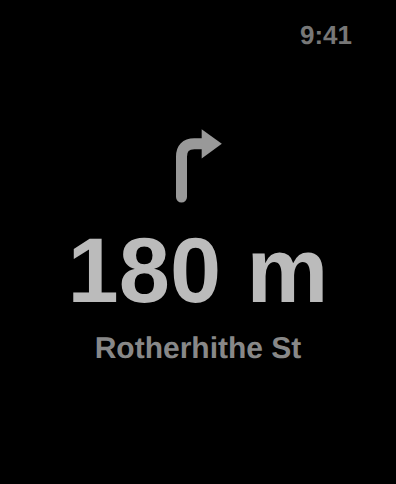

# Apple Watch

Target `RoadsAndRunesWatch` (watchOS 10). Responsibilities: turn navigation,
route map, quest objective, ride statistics, objective notifications,
pause/end, heart-rate workout. Works with the phone locked.

## Data flow

```
iPhone RideRecorder ──WCSession.sendMessage / updateApplicationContext──► Watch
   • RoutePackageSummary once at start (instructions, simplified geometry, objectives)
   • NavigationUpdate throttled (1 s FULL / 3 s BALANCED / 10 s ENDURANCE, `BatteryPolicy`):
       nextInstruction, distanceToTurn, streetName, objectiveTitle,
       objectiveDistance, stats snapshot, navigationState
   • ObjectiveCompleted events (haptic .success on watch), with an optional
       `outcome` for the overlay's heading: GONE, OPENED, FOUND or DONE
   • EncounterBeat (0.6.1): ENGAGED or LOOSENED, felt as one tap and never
       shown. Sent only while the Watch is reachable, never inside a turn's
       window and never while off route. A Watch build before 0.6.1 ignores it
Watch ──► iPhone: pause / resume / end commands, heart-rate samples
```

Every tap the Watch gives is named in Core (`WristTap`). Turns own `click`,
`directionUp` and `directionDown`; a fight may only use `start`, `success` and
`failure`, and `WristTapTests` keeps the two sets apart.

The watch runs its own `HKWorkoutSession` (cycling, outdoor) so heart rate
streams and the workout continues if the phone connection drops. It keeps the
last received instruction on screen and logs `watch_disconnected`; it never
invents navigation.

## Screens (paged TabView)

| Navigation | Quest | Stats | Objective complete | Always-On |
|---|---|---|---|---|
|  |  |  |  |  |


Five vertical pages (`App/ContentView.swift`, `RidePages`):

1. **Navigation** – arrow glyph, distance to turn, direction word, street
   name. Nothing else.
2. **Map** – the route and where you are on it. Hidden in Always-On.
3. **Quest** – quest title, current objective, distance to it, and the
   nearest thing on the route ("Bog Wraith · 120 m").
4. **Stats** – distance, duration, new ground, distance to go, climbed, heart
   rate. Speed is available but small.
5. **Controls** – pause/resume, end ride (confirm).

**Turn taps** are worked out on the Watch from the navigation updates
(`Core/Watch/TurnCue.swift`): two clicks as a turn comes up at 150 m, then at
35 m one tap for a right and two for a left. Any other tap the game adds must
use a different haptic, so nothing on the wrist can be mistaken for a turn.

A claim or a finished objective takes over the screen for about 4 s with a
success haptic ("YOURS" / "OBJECTIVE COMPLETE", the name, the coins, a set's
standing such as "Old Runes, 3 of 6") and returns to navigation. No
interaction required.

## Always-On

`isLuminanceReduced` switches to simplified layouts: no map, larger next-turn
text, no animations, stats refresh every 5 s. The next turn must remain
readable in Always-On.

## Battery

Watch rendering is deliberately minimal; the phone owns GPS and route
matching. `BatteryPolicy` sets update intervals per mode; ENDURANCE relies
more on Watch turn cues and fewer phone screen wakes.

## Field tests

Required before beta: phone locked in pocket, Watch disconnect/reconnect,
tunnel, long ride > 3 h, rain glove use of pause/end. A ride is started on the
phone; the Watch follows it (it has no GPS of its own and cannot start one
yet). See protocol 5 in `docs/FIELD_TESTS.md`.
